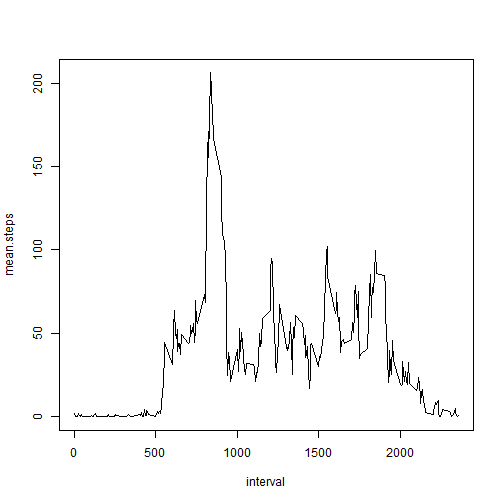
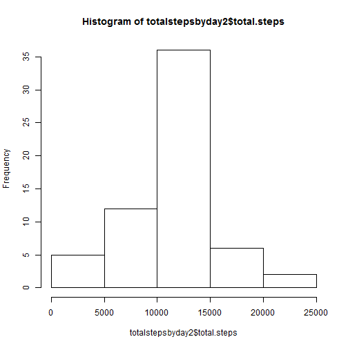
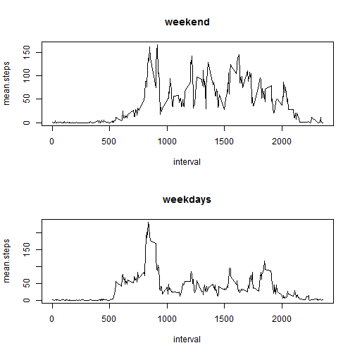

## Loading and preprocessing the data
Load the data into a data.table.

```r
library(data.table)
```

```r
setwd("~\\Courses\\Coursera-DataScientist\\Reproducible Reaearch\\Assignment 1\\RepData_PeerAssessment1")
rawdata <- fread("activity.csv")
```

## What is mean total number of steps taken per day?
First, ignore incomplete data rows.
Then, set the key to the date column, sum the dates by day and calculate the mean.

```r
cleandata <- rawdata[complete.cases(rawdata)]
setkey(cleandata, date)
totalstepsbyday <- cleandata[,sum(steps),by=date]
setnames(totalstepsbyday, c("date", "total.steps"))
mean(totalstepsbyday$total.steps)
```

```
## [1] 10766.19
```

## What is the average daily activity pattern?
Set the key to the interval column, Calculate the mean by interval, and plot.

```r
setkey(cleandata, interval)
meanbyinterval <- cleandata[, mean(steps), by=interval]
setnames(meanbyinterval, c("interval", "mean.steps"))
plot(meanbyinterval, type = "l")
```

 

## Imputing missing values
1. Calc the total number of NAs in the dataset

```r
nrow(rawdata) - sum(complete.cases(rawdata))
```

```
## [1] 2304
```

2. Fill in missing data using mean for interval.
First, add the mean steps by interval using a join.
Then add another column called 'fullsteps' that has either the non-NA steps or the mean value.

```r
data2 <- merge(rawdata, meanbyinterval, by="interval")
data3 <- data2[order(date, interval), ]


fill.na <- function(steps, means) {
    if (is.na(steps)) { means } else { steps }
}

fullsteps = mapply(fill.na, data3$steps, data3$mean.steps)
```

3. Create a new dataset that is equal to the original dataset but with the missing data filled in.

```r
fulldata <- data.table(interval=data3$interval, steps=fullsteps, date=data3$date)
head(fulldata)
```

```
##    interval     steps       date
## 1:        0 1.7169811 2012-10-01
## 2:        5 0.3396226 2012-10-01
## 3:       10 0.1320755 2012-10-01
## 4:       15 0.1509434 2012-10-01
## 5:       20 0.0754717 2012-10-01
## 6:       25 2.0943396 2012-10-01
```

4. Make a histogram of the total number of steps taken each day

```r
setkey(fulldata, date)
totalstepsbyday2 <- fulldata[,sum(steps),by=date]
setnames(totalstepsbyday2, c("date", "total.steps"))
hist(totalstepsbyday2$total.steps)
```

 

Calculate and report the mean and median total number of steps taken per day.

```r
meansteps1 <- mean(totalstepsbyday$total.steps)
mediansteps1 <- median(totalstepsbyday$total.steps)

meansteps2 <- mean(totalstepsbyday2$total.steps)
mediansteps2 <- median(totalstepsbyday2$total.steps)
```

The mean total number of steps taken per day is:   
On the raw data with NULLs:     1.0766189 &times; 10<sup>4</sup>  
After we filled empty data:     1.0766189 &times; 10<sup>4</sup>  


The median total number of steps taken per day is:   
On the raw data with NULLs:     10765  
After we filled empty data:     1.0766189 &times; 10<sup>4</sup>  

Do these values differ from the estimates from the first part of the assignment?
The are the same.

## Are there differences in activity patterns between weekdays and weekends?

1. Create a new factor variable in the dataset with two levels – “weekday” and 
“weekend” indicating whether a given date is a weekday or weekend day.


```r
is.weekend <- function(d) {
    dow <- wday(as.Date(d))
    if (dow==1 | dow==7)  {
        "Weekend"
    } else {
        "Weekday"
    }
}

fulldata2 <- fulldata[, daytype:=mapply(is.weekend, fulldata$date)]
```

2. Make a panel plot containing a time series plot (i.e. type = "l") 
of the 5-minute interval (x-axis) and the average number of steps taken, 
averaged across all weekday days or weekend days (y-axis).

```r
setkey(fulldata2, daytype)
splitbyday <- split(fulldata2, fulldata$daytype)
weekdaydata <- splitbyday$Weekday[, mean(steps), by=interval]
setnames(weekdaydata, c("interval", "mean.steps"))
weekenddata <- splitbyday$Weekend[, mean(steps), by=interval]
setnames(weekenddata, c("interval", "mean.steps"))

par(mfrow=c(2,1))
plot(weekenddata, type = "l", main="weekend")
plot(weekdaydata, type = "l", main="weekdays")
```

 

